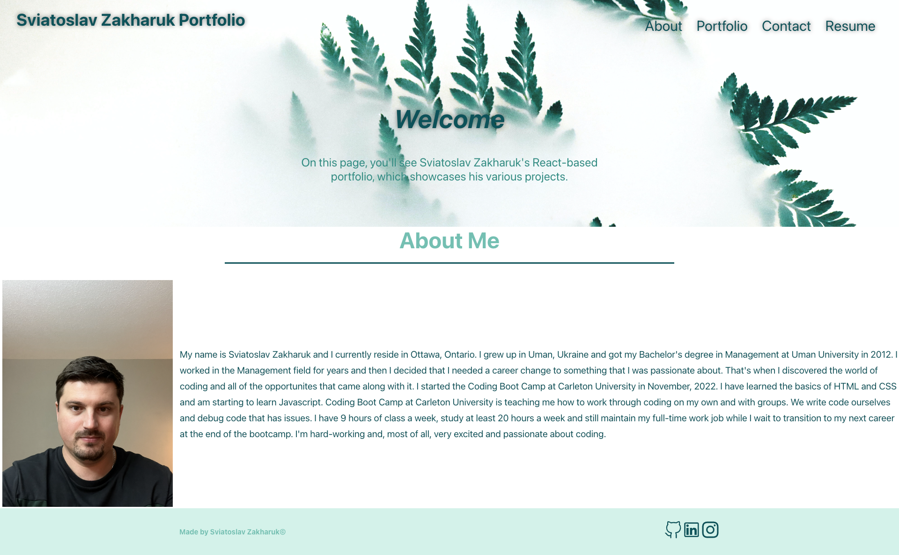
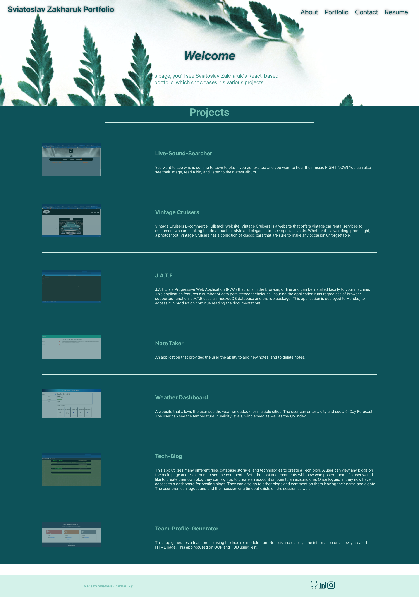

# REACT-Portfolio
 React Portfolio

## Description 

As a web developer, I want to create a React portfolio to showcase my skills and experience to potential employers, so that they can assess my abilities and consider me for job opportunities. 

## Table of Contents
* [License](#license)
* [Installation](#installation)
* [User Story](#user-story)
* [Acceptance Criteria](#acceptance-criteria)
* [Screenshots](#screenshots)
* [Link](#link)
* [Usage](#usage)

## License 
This project is license under MIT 

## Installation 

1. Clone the repository from GitHub
1. Install `node.js`
1. Run `npm install` to install dependencies. 
1. Run `npm start` to start the web server and connect

## User Story
As a job seeker, I want to showcase my skills and projects professionally through my React portfolio, so potential employers can quickly assess my abilities and consider me for job opportunities.

## Acceptance Criteria

## Screenshots 

## Link 
<a href="https://bunix25.github.io/React-Portfolio/#about">Click Here</a>

## Usage 

To create a portfolio, using React. The user can review an About Me section, a sample Portfolio, and a contact form, and be able to download the Resume.

